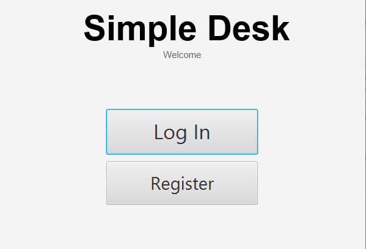
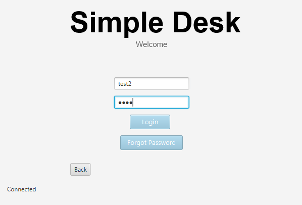
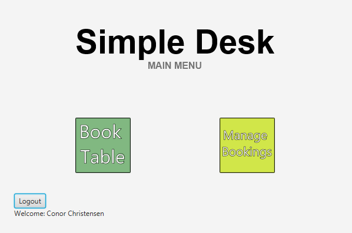
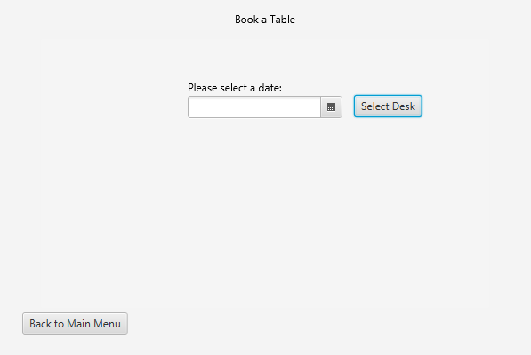
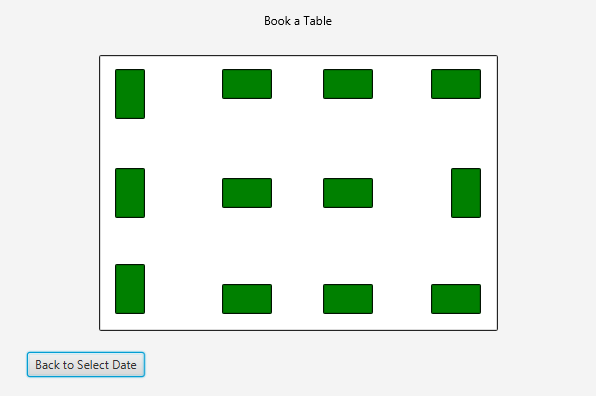
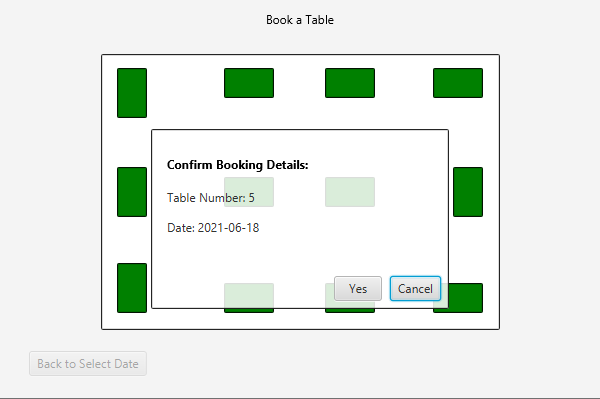
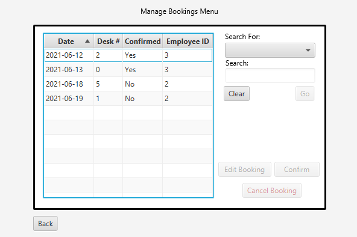
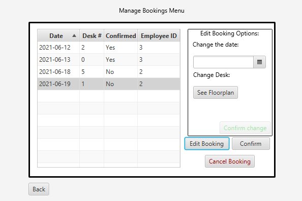
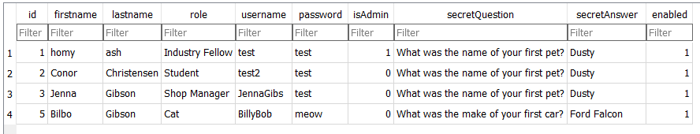

# Readme
Simple Desk

Created By Conor Christensen

Student Number - s3815282

Submission 11/06/2021

# Packaging
The main class is Main.java

Packaging for classes:
 - main.controller
 - main.model
 - main.ui

#Simple Desk

This application is a desk booking application used for modern hot-desking enterprises in a COVID/post-COVID world. The System can 
be accessed by authorised administrators and employees, and is used as a way for employees to book their space in the office
ahead of time. The employees can select desks and dates, and can edit these parameters for each booking until that booking is confirmed by 
the System administrator. Once a bookings is confirmed the employee can cancel the booking if necessary. All unconfirmed bookings are 
cancelled within 24 hours of the sit. Users can book any table that is deemed "available", however they have no knowledge as to
the reasoning of the availability (lockdown or other booking). This is an intended feature as it is not within the employee's
purview to understand why a table is unavailable. 

The Administrator has executive authority over all bookings made, and is able to confirm, cancel, and edit all bookings within the system.
The System administrator is also able to lockdown tables. This can be done individually on specified tables or desks, or a general COVID-lockdown
can be applied in 3 stages. Stage 0 is not lockdown, business as usual. Stage 2 restricts every 2nd desk from being booked, and cancels all
existing bookings on those desks. Stage 3 restricts all further bookings within the specified time window and also counts all bookings made
within that period. The Administrator also has the ability to manage account details of existing employees, create new employee accounts, or
delete/disable existing employee accounts.

The Application uses a Menus driven UI that gives simple and easy-to-understand visuals to the users which can easily direct them
to the required functionality within the application. 

The Menu Driven Design can be seen below with a "Log in and book table" flow shown in the images.

Further screenshots on Admin managing bookings:

#Use Instructions
Administrator accounts must be Directly added to the database. Employee accounts can be made from the registration page. In
this repository an SQLite database is used ans is populated with some upcoming and past bookings, and some user accounts. These
can all be inspected using DB Browser. However, for evaluation, here are some Admin and Employee details so you can log in and demo 
the product.

#Structure Details

The application was written using Java 8, and the UI was developed using SceneBuilder for JavaFX. The project uses an MVC structure and 
OOP design. The project contains examples of Class inheritance (ManageBookings emp/admin controllers and models), method overriding
(getBookings()), and method overloading (getUpcomingBookings()). Further, the interface Initializable is implemented in many controllers.
There are examples of advanced structures within the project. Singleton classes are used for ProfileHolder, DBManagement, PaneManeger and SceneSwitcher,
which are all cases which either strictly require only one instance (ProfileHolder) or run more efficiently with one instance. The DBManagement, PaneManager
and SceneSwitcher classes are also examples of Facades. These classes are used my multiple controller and model methods (respectively) as they
provide the code for repeatedly called methods that assist in operating both the UI and Database-information-management.

There are consistant uses of try/catch blocks throughout the code. If an exception is expected, there are surrounding comments explaining why,
and the catch block is used as a tool for application functionality. Exceptions have also been created to be thrown in special cases:
DuplicateIDException, DuplicateUsernameException, and EmployeeDoesNotExist. All these exceptions assist the application's functionality
and the user experience.

#Run details
To run the application, the Main.java class in the top project folder can be run using the start() method. This will open the application window.

#Bugs and refactoring
To the developers knowledge the application works almost entirely as intended. There were complications in the late stages of deployment that
found the application crashing whenever a booking was edited. The application would simply stop responding. Some fixes and refactoring found
code innefficiencies that have since been fixed regarding how the tableView refreshes the column data. However, only on a rare occasion it seems, when 
deleting a booking as an Employee this same problem occurs. There was not enough time remaining to completeley fix the Issue. However, the database is updated
before the application crashes, so the problem appears to exist in the controller class and in the UI layer.

The Only other known bug is that a stack-trace is printed to the console if a report with the name of an existing report (eg two identical dates) is created.
This does not crash the application, however a new version of that report is not created. This could likely be fixed with some more time
developing the CSV Write functionality.
